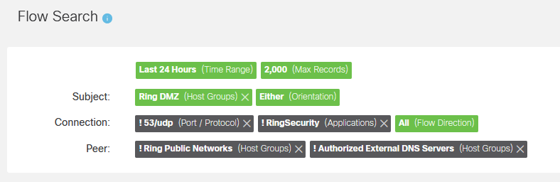

<div id="top"></div>
<!--
*** Thanks for checking out the Best-README-Template. If you have a suggestion
*** that would make this better, please fork the repo and create a pull request
*** or simply open an issue with the tag "enhancement".
*** Don't forget to give the project a star!
*** Thanks again! Now go create something AMAZING! :D
-->


<!-- PROJECT SHIELDS -->
<!--
*** I'm using markdown "reference style" links for readability.
*** Reference links are enclosed in brackets [ ] instead of parentheses ( ).
*** See the bottom of this document for the declaration of the reference variables
*** for contributors-url, forks-url, etc. This is an optional, concise syntax you may use.
*** https://www.markdownguide.org/basic-syntax/#reference-style-links
-->

[![Stargazers][stars-shield]][stars-url]
[![Issues][issues-shield]][issues-url]
[![MIT License][license-shield]][license-url]
[![LinkedIn][linkedin-shield]][linkedin-url]


<!-- PROJECT LOGO -->
<br />
<div align="center">
  <a href="https://github.com/othneildrew/Best-README-Template">
    
  </a>

  <h3 align="center">SNA Autometron</h3>

  <p align="center">
    Identify Peer IP addresses and Add to the Hostgroup of Your Choice!
    <br />
    <a href="https://github.com/othneildrew/Best-README-Template/issues">Report Bug</a>
    ·
    <a href="https://github.com/othneildrew/Best-README-Template/issues">Request Feature</a>
  </p>
</div>


<!-- TABLE OF CONTENTS -->
<details>
  <summary>Table of Contents</summary>
  <ol>
    <li>
      <a href="#about-the-project">About The Project</a>
      <ul>
        <li><a href="#built-with">Built With</a></li>
      </ul>
    </li>
    <li>
      <a href="#getting-started">Getting Started</a>
      <ul>
        <li><a href="#prerequisites">Prerequisites</a></li>
        <li><a href="#installation">Installation</a></li>
      </ul>
    </li>
    <li><a href="#usage">Usage</a></li>
    <li><a href="#roadmap">Roadmap</a></li>
    <li><a href="#contributing">Contributing</a></li>
    <li><a href="#license">License</a></li>
    <li><a href="#contact">Contact</a></li>
    <li><a href="#acknowledgments">Acknowledgments</a></li>
  </ol>
</details>


<!-- ABOUT THE PROJECT -->
## About The Project

Use this to look up Outside Host IP addresses and look for domain data.  That data will allow you to drop those identified IP addresses into your chosen host groups.  


<p align="right">(<a href="#top">back to top</a>)</p>


### Built With

* [Python](https://python.org/)

#### APIs Used
* [Shodan API Reference](https://developer.shodan.io/api)
* [Cisco Secure Network Analytics API Reference](https://developer.cisco.com/docs/stealthwatch/enterprise/)

<p align="right">(<a href="#top">back to top</a>)</p>


<!-- GETTING STARTED -->
## Getting Started

This is an example of how you may give instructions on setting up your project locally.
To get a local copy up and running follow these simple example steps.
<!--
### Prerequisites

This is an example of how to list things you need to use the software and how to install them.
* npm
  ```sh
  npm install npm@latest -g
  ```
-->

### Installation

1. Clone the repo
   ```sh
   git clone https://github.com/gobblegoob/SNA-Automatron.git
   ```
2. Install dependencies from requirements.txt
   ```sh
   pip install -r requirements.txt
   ```
3. Obtain an API key for Shodan.  This can be done by creating a free account at https://www.shodan.io

<p align="right">(<a href="#top">back to top</a>)</p>


<!-- USAGE EXAMPLES -->
## Usage

### ScanToUPdate.py

Use this to scan for a single domain to update a single host tag.  Allows you to make a more specific Flow Query to keep the number of Shodan api lookups down.<br><br>
Usage: ScanToUpdate.py [-h] [-d DOMAIN] [-t TAG] [-c CERTSTRING] [-rx]

<table>
  <tr>
    <td width = 300><b>Arguments</b></td><td width=500><b>Description</b></td>
  </tr>
  <tr><td>-h, --help</td><td>show this help message and exit</td></tr>
  <tr><td>-d DOMAIN, --domain DOMAIN</td><td>Domain you wish to search for</td></tr>
  <tr><td>-t TAG, --tag TAG</td><td>What tag or hostrgroup to you wish to update for the given domain</td></tr>
  <tr><td>-c CERTSTRING, --certstring CERTSTRING</td><td>Enter a regex match string for cert CN and SAN fields</td></tr>
  <tr><td>-rx, --reportxlsx</td><td>Output unknown domains to an excel file</td></tr>
</table>

### MultiScan.py
Use this to search many domains and update many host groups.  Will require a more generalized flow query so there may be more Shodan queries resulting in longer run time.<br><br>
Usage: MultiScan.py [-h] [-l] [-rx] [-t TIME] [-ld]

<table>
  <tr>
    <td width = 300><b>Arguments</b></td><td width=500><b>Description</b></td>
  </tr>
  <tr><td>-h, --help</td><td>show this help message and exit</td></tr>
  <tr><td>-l, --log</td><td>Add output to a log file (Not yet functional</td></tr>
  <tr><td>-rx, --reportxlsx</td><td>Output unknown domains to an excel file</td></tr>
  <tr><td>-t TIME, --time TIME</td><td>Flow report time in minutes.  Default is 1440 (24 hours)</td></tr>
  <tr><td>-ld, --listdomains</td><td>List domains to scan</td></tr>
</table>

You must esignate your domains, cert strings, and destination hostgroups in MultiScan.py by editing the MY_DATA dictionary.  The dictionary is formatted as below
```
MY_DATA = {
    'domain1.com': {
        'certstr': 'Cert CN or SAN Regex',
        'destinationtag': 'Name of Hostgroup'
    },
    'domain2.com': {
        'certstr': 'Cert CN or SAN regex',
        'destinationtag': 'Name of another Hostgroup'
    }
}
...
```

### Setup
The application will perform the following tasks:
1. Execute a Flow Query on SNA per the query parameters you apply in the sna.json file
2. With the results from the flow query, it will query shodan for domain or certificate CN and SAN field data to try and identify a public IP
3. Will then take the IP's that correspond to your target domains and insert them into your designated Host Group/Tag

<p>Before you set up the script - you need to design a Flow Query to identify the target peer IP addresses you want to query Shodan for.  The results of this query will be looked up in Shodan where domain and certificates CN/SANs will be checked to see if they match your targeted domain.  Design and hone your Flow Query in the SNA Flow Query screen.  Once you have designed your query - you can easily transfer the query parameters to the sna.json file.  </p>

<p> ** Example query: ** </p> 


### To set up:
 - Add your API key to shodan.json
 - Add the following data to sna.json
 <li>SMC hostname/IP and credentials
 <li>Source/Subject Hostgroups to include and exclude from your query
 <li>Destination/Peer hostgroups to include and exclude from your query
 
 ### Optional:
 You can add values for the following global variables to make it easier to run the application.  These variables are kept in [FILE]
 1. <br>MY_DOMAIN</br> - This is the domain you want to search
 2. <br>MY_TAG_TO_UPDATE</br> - This is the destination host group - all IP's that match your search criteria will be automatically added to this host group
 3. <br>CERT_STR - Sometimes a domain won't be listed in Shodan - this is a regex string you can add to match part of the CN or SAN fields in a site certificate as captured by Shodan.

### Scheduling:
The best way to run this is to run cronjobs calling the scripts wiht the accompanying arguments.  This allows you to run the script against several domains and populate several different host groups without making any changes to code.  You can schedule a cron job in linux to execute the script. To run the script at 11pm each day and output a log file for tracking, add the folloiwng to your crontab file:
```
00 23 * * * cd /[path/to/file] && python ScanToUpdate.py -d [DOMAIN.COM] -t [HOSTGROUP TO UPDATE] -c [REGEX TO SEARCH IN CERT CN OR SAN FIELD] >> tagupdate.log 
20 23 * * * cd /[path/to/file] && python ScanToUpdate.py -d [DOMAIN2.COM] -t [HOSTGROUP TO UPDATE] -c [REGEX TO SEARCH IN CERT CN OR SAN FIELD] >> tagupdate.log 
40 23 * * * cd /[path/to/file] && python ScanToUpdate.py -d [DOMAIN3.COM] -t [HOSTGROUP TO UPDATE] -c [REGEX TO SEARCH IN CERT CN OR SAN FIELD] -rx >> tagupdate.log 
```

- **[Cron Job: A Comprehensive Guide for Beginners 2023](https://www.hostinger.com/tutorials/cron-job)**
- **[Crontab Generator](https://crontab-generator.org/)**

<p align="right">(<a href="#top">back to top</a>)</p>


<!-- ROADMAP -->
## Roadmap

- [ ] generate log file


See the [open issues](https://github.com/othneildrew/Best-README-Template/issues) for a full list of proposed features (and known issues).

<p align="right">(<a href="#top">back to top</a>)</p>


<!-- CONTRIBUTING -->
## Contributing

If you wish to contribute or have feature or usage suggestions, leave me a message.

<p align="right">(<a href="#top">back to top</a>)</p>


<!-- LICENSE -->
## License

Distributed under the MIT License. See `LICENSE.txt` for more information.

<p align="right">(<a href="#top">back to top</a>)</p>


<!-- CONTACT -->
## Contact

Project Link: [https://github.com/gobblegoob/SNA-Automatron](https://github.com/gobblegoob/SNA-Automatron)

<p align="right">(<a href="#top">back to top</a>)</p>


<!-- ACKNOWLEDGMENTS -->
## Acknowledgments


Thank yous

* [denapom11 SNA Examples](https://github.com/CiscoDevNet/stealthwatch-enterprise-sample-scripts)
* [othneildrew Best README Template](https://github.com/othneildrew/Best-README-Template)


<p align="right">(<a href="#top">back to top</a>)</p>


<!-- MARKDOWN LINKS & IMAGES -->
<!-- https://www.markdownguide.org/basic-syntax/#reference-style-links -->
[contributors-shield]: https://img.shields.io/github/contributors/othneildrew/Best-README-Template.svg?style=for-the-badge
[contributors-url]: https://github.com/othneildrew/Best-README-Template/graphs/contributors
[forks-shield]: https://img.shields.io/github/forks/othneildrew/Best-README-Template.svg?style=for-the-badge
[forks-url]: https://github.com/othneildrew/Best-README-Template/network/members
[stars-shield]: https://img.shields.io/github/stars/othneildrew/Best-README-Template.svg?style=for-the-badge
[stars-url]: https://github.com/gobblegoob/SNA-Automatron/stargazers
[issues-shield]: https://img.shields.io/github/issues/othneildrew/Best-README-Template.svg?style=for-the-badge
[issues-url]: https://github.com/gobblegoob/SNA-Automatron/issues
[license-shield]: https://img.shields.io/github/license/othneildrew/Best-README-Template.svg?style=for-the-badge
[license-url]: https://github.com/gobblegoob/SNA-Automatron/blob/main/LICENSE
[linkedin-shield]: https://img.shields.io/badge/-LinkedIn-black.svg?style=for-the-badge&logo=linkedin&colorB=555
[linkedin-url]: https://linkedin.com/in/
[product-screenshot]: images/screenshot.png
